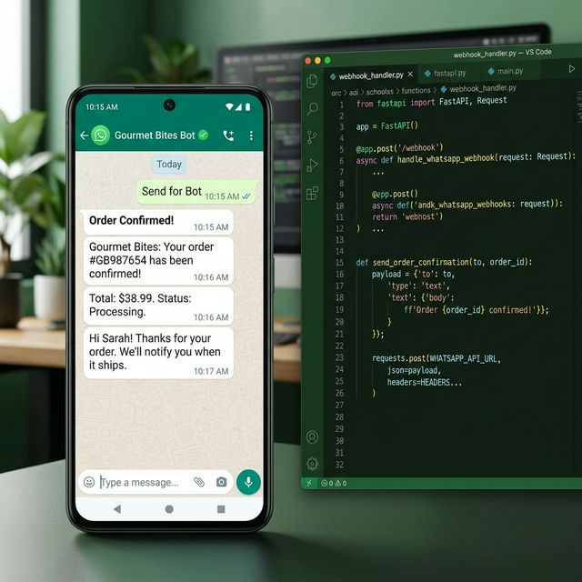

# WhatsApp Customer Support Bot

An intelligent customer service bot built natively on the Meta Cloud API to handle order tracking, FAQ routing, and proactive SMS-style notifications automatically.

✔ Drastically reduces customer support tickets by allowing users to self-serve order statuses via chat
✔ Increases customer satisfaction with instant, interactive button responses instead of rigid text menus
✔ Seamlessly integrates with your existing backend to trigger proactive shipping and delivery alerts

## Use Cases
- **E-Commerce Order Tracking:** Automatically reply to "Where is my order?" messages by querying your CRM in real-time.
- **Appointment Reminders:** Send proactive WhatsApp alerts to patients or clients to drastically reduce no-show rates.
- **Lead Qualification:** Use interactive buttons (e.g. "Get Pricing", "Talk to Sales") to instantly route high-intent leads to the right human agent.

## Project Structure

```
whatsapp-business-bot/
├── main.py                 # FastAPI app + webhook endpoints
├── app/
│   ├── config.py           # Settings from .env
│   ├── whatsapp.py         # Meta Cloud API client
│   ├── handlers.py         # Incoming message dispatcher
│   └── notifications.py    # Outbound order notification helpers
├── requirements.txt
└── .env.example
```

## Setup

### 1. Meta App Configuration
1. Create an app at [Meta for Developers](https://developers.facebook.com/)
2. Add **WhatsApp** product → get your `Phone Number ID` and `Access Token`
3. Set webhook URL to `https://yourdomain.com/webhook`
4. Set `Verify Token` to match your `.env`
5. Subscribe to the `messages` field

### 2. Install & Run

```bash
pip install -r requirements.txt
cp .env.example .env
# Fill in WHATSAPP_TOKEN, WHATSAPP_PHONE_ID, VERIFY_TOKEN
uvicorn main:app --host 0.0.0.0 --port 8000
```

For local testing, use [ngrok](https://ngrok.com/) to expose localhost:
```bash
ngrok http 8000
# Use the https URL as your webhook in Meta Dashboard
```

## Endpoints

| Method | Path | Description |
|---|---|---|
| `GET` | `/webhook` | Meta webhook verification |
| `POST` | `/webhook` | Receive incoming messages |
| `POST` | `/notify/order` | Send order notification to customer |
| `GET` | `/health` | Health check |

## Example — Order Notification

```bash
curl -X POST http://localhost:8000/notify/order \
  -H "Content-Type: application/json" \
  -d '{
    "phone": "+905551234567",
    "order_id": "ORD-1042",
    "customer_name": "Alice",
    "status": "shipped",
    "detail": "Tracking: TRK-9988"
  }'
```

## Conversation Flow

```
User: "hi"
Bot:  [Interactive buttons] Track Order | Get Support | Pricing

User: [taps Track Order]
Bot:  "Please share your order ID"

User: "ORD-1042"
Bot:  "Order ORD-1042 — Status: In Transit 🚚"
```

## Tech Stack

`fastapi` · `uvicorn` · `httpx` · `pydantic-settings`

## Screenshot



